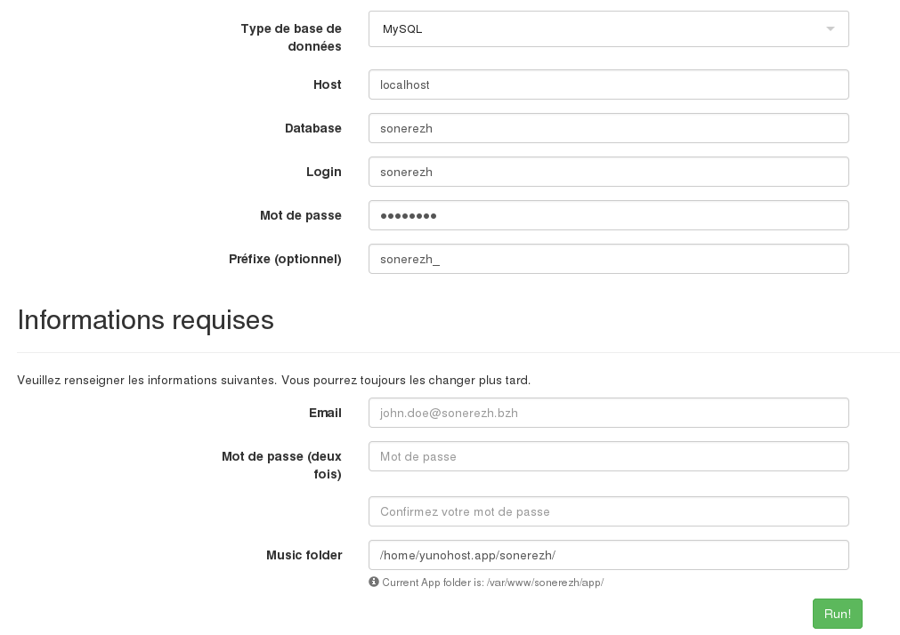

# Sonerezh package for YunoHost

* [Sonerezh website](https://www.sonerezh.bzh/)
* [YunoHost website](https://yunohost.org/)

## Postinstallation
Currently, you will have to do manually postinstallation.
There is [an issue](https://github.com/YunoHost-Apps/sonerezh_ynh/issues/1) to solve that issue. But I wasn't able to solved it.

You will have to go to `/sonerezh/install/` and put this parameters:

- Database password is: `sonerezh`.
- Put your email and password to create an account.

## Music
Actually, Sonerezh do not provide a web interface to upload music.
You have to store your music in `/home/yunohost.app/sonerezh`.
Sonerezh will update your music.
